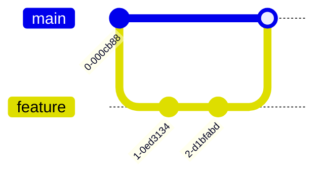

# 项目开发指南

## 1. 环境配置

### 1.1 系统要求
- Python 3.8+
- pip 20.0+
- Git 2.30+

### 1.2 依赖安装
```bash
pip install -r requirements.txt
```

### 1.3 虚拟环境配置


具体步骤：
```bash
# 创建虚拟环境
python -m venv .venv

# 激活环境 (Windows)
.\.venv\Scripts\activate

# 激活环境 (Linux/Mac)
source .venv/bin/activate

# 安装完整依赖 (包含监控工具)
pip install watchdog psutil pywin32 python-dotenv

# 验证环境
python check_environment.py
```

## 2. 代码规范

### 2.1 代码风格
- 遵循PEP 8规范
- 使用以下工具保证代码质量：
  - **Black**: 自动格式化Python代码
  - **Flake8**: 检查代码风格
  - **Mypy**: 静态类型检查

运行检查：
```bash
# 格式化代码
black .

# 检查代码风格
flake8 .

# 类型检查
mypy .
```

配置说明：
- 行长度限制: 88字符
- 类型检查严格模式
- 复杂度限制: 10

### 2.2 文档要求
- 所有公共API必须包含docstring
- 模块级文档包含在README.md中
- 复杂算法需要注释说明

## 3. CI/CD流程

### 3.1 GitHub Actions
项目使用GitHub Actions实现持续集成：
- 每次push或PR触发
- 自动运行测试
- 检查代码风格和类型
- 必须通过所有检查才能合并

[查看CI配置](.github/workflows/ci.yml)

### 3.2 本地验证
提交前请确保通过以下检查：
```bash
# 运行测试
python -m pytest tests/

# 格式化代码
black .

# 静态检查
flake8 .
mypy .
```

## 4. 提交流程

### 3.1 分支策略


### 3.2 提交信息规范
- 格式: `<类型>: <描述>`
- 类型: feat|fix|docs|style|refactor|test|chore

## 4. 发布流程

### 4.1 版本号管理
- 遵循语义化版本(SemVer)
- 主版本号: 不兼容的API修改
- 次版本号: 向下兼容的功能新增
- 修订号: 向下兼容的问题修正

### 4.2 发布检查清单
- [ ] 所有测试通过
- [ ] 文档更新完成
- [ ] 版本号已更新
- [ ] 变更日志已记录

## 5. 测试指南

### 5.1 运行测试
```bash
python -m pytest tests/
```

### 5.2 测试覆盖率
```bash
pytest --cov=modules tests/
```

## 6. 贡献指南

### 6.1 问题报告
- 使用Issue模板
- 提供重现步骤
- 包含环境信息

### 6.2 功能请求
- 描述使用场景
- 提供业务价值分析
- 建议实现方案