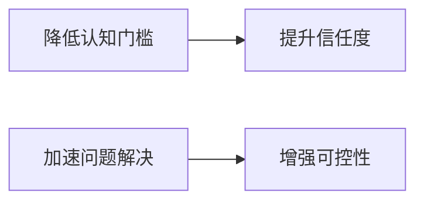

# 智能可视化系统设计

## 设计背景
1. **用户需求**：
   - 理解AI决策过程
   - 直观查看执行结果
   - 交互式问题诊断

2. **系统价值**：


## 核心架构
1. **数据流设计**：
   - 决策日志采集
   - 知识图谱构建
   - 可视化渲染引擎

2. **组件关系**：
```python
class VisualizationSystem:
    def __init__(self):
        self.log_parser = DecisionLogParser()
        self.knowledge_graph = KnowledgeGraph()
        self.render_engine = RenderEngine()
    
    def show_decision_path(self, session_id):
        """展示完整决策路径"""
        logs = self.log_parser.load(session_id)
        graph = self.knowledge_graph.build(logs)
        return self.render_engine.render(graph)
```

## 实施计划
| 阶段 | 时间 | 交付物 |
|------|------|--------|
| 1.基础框架 | 2周 | 日志采集系统 |
| 2.核心功能 | 3周 | 决策路径可视化 |
| 3.交互优化 | 2周 | 诊断控制台 |

## 预期指标
- 决策透明度提升：50%
- 用户疑问减少：40%
- 平均解决时长缩短：35%