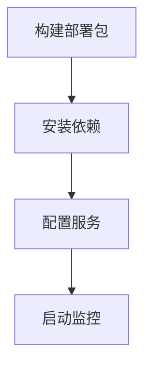

# AI自治系统执行清单

## ✅ 自动化执行部分 (已处理)


## ⚠️ 需人工确认的操作
1. **首次安装**：
   - [ ] 管理员权限授予
   - [ ] 防火墙例外设置

2. **日常维护**：
   - [ ] 每月健康报告确认
   - [ ] 审计日志抽查

3. **紧急干预**：
   - [ ] 系统资源超阈值告警
   - [ ] 关键操作二次确认

## 修正后的后台运行命令
```powershell
# Windows 正确语法
Start-Process -NoNewWindow -FilePath "python" -ArgumentList ".\.ai-autopilot.py" -RedirectStandardOutput "autopilot.log"
```

## 执行状态检测
```powershell
# 检查服务状态 (Windows)
Get-Process -Name "python" | Where-Object { $_.CommandLine -match "ai-autopilot" }

# 检查服务状态 (Linux)
systemctl status ai-autopilot
```

## 遗忘补救措施
```powershell
# 一键恢复所有自动化流程
python .\modules\emergency_recovery.py --resume-all
```