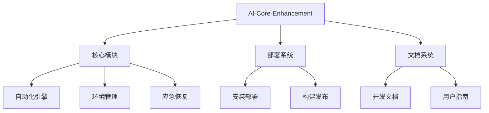

# AI核心增强工程解读指南

## 工程架构


## 核心模块说明

### 1. 自动化引擎
- `.ai-autopilot.py`: 主控脚本
- `modules/command_executor.py`: 命令执行器
- `modules/analysis_engine.py`: 分析引擎

### 2. 环境管理
- `modules/env_fixer.py`: Python环境修复
- `modules/path_cleaner.ps1`: PATH清理工具
- `config/mapping_rules.json`: 环境映射规则

### 3. 应急系统
- `modules/emergency_recovery.py`: 应急恢复
- `backups/`: 自动备份目录
- `execution-checklist.md`: 恢复清单

## 典型工作流

1. **环境准备**:
```powershell
python modules/env_fixer.py
.\modules\path_cleaner.ps1
```

2. **日常运行**:
```powershell
python .ai-autopilot.py
```

3. **维护更新**:
```powershell
.\modules\project_cleaner.ps1 -dryRun
.\deploy\build-local.bat
```

## 文档体系
1. **开发文档**:
   - `DEVELOPMENT_GUIDE.md`: 开发规范
   - `docs/core/`: 核心设计文档

2. **用户文档**:
   - `docs/user_info.md`: 用户手册
   - `docs/examples/`: 使用示例

3. **系统文档**:
   - `docs/system/`: 系统架构
   - `CHANGELOG.md`: 变更日志

## 扩展建议
1. 添加`requirements.txt`管理Python依赖
2. 增加CI/CD流水线配置
3. 补充单元测试覆盖率
```