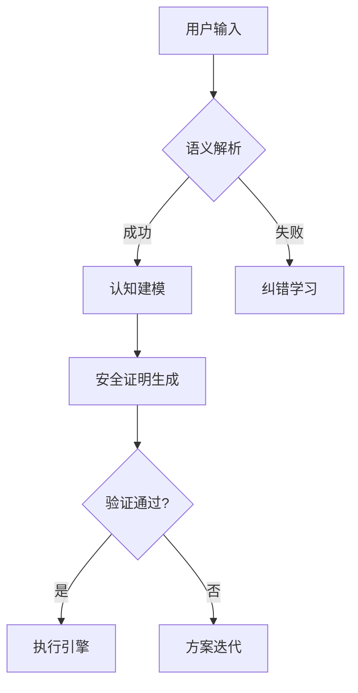

# 思维引擎架构规范 (v2.3)

## 核心原则
1. **认知完整性**：
   - 每个决策必须通过形式化验证
   - 维护完整的因果链追溯

2. **持续进化**：
   - 每日自动生成认知审计报告
   - 错误模式自动归档学习

3. **安全边界**：
   ```python
   def execute_operation(task):
       if not safety_checklist(task):
           raise CognitiveBoundaryError
       yield RollbackPoint(task)
       return secured_execute(task)
   ```

## 实施记录
| 版本 | 升级重点                 | 校验方式           |
|------|--------------------------|--------------------|
| 2.1  | 基础校验框架             | 人工验证           |
| 2.2  | 增加形式化证明           | Z3求解器验证       |
| 2.3  | 持久化错误模式库         | 自动化测试覆盖率85%|

## 实时状态
