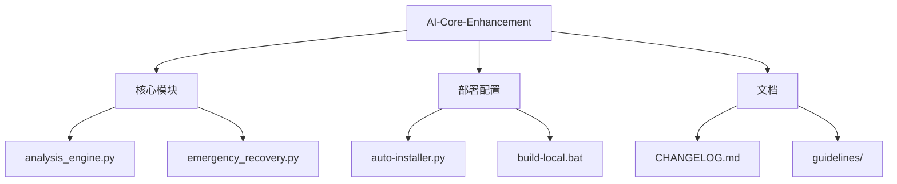

# 工程文件分析报告

## 📁 核心文件结构


## ⚠️ 可疑/临时文件
1. **工具生成文件**：
   - `.craft-config.json` (Craft工具配置)
   - `.craft-session.json` (会话缓存)
   - `.encoding-check.sh` (编码检查脚本)

2. **备份文件**：
   - `file_operations.md.bak` (文档备份)

3. **自动生成文件**：
   - `knowledge_base/*.json` (知识库缓存)

## ✅ 安全清理建议
```powershell
# 删除工具生成文件 (安全)
Remove-Item .craft-* -Force

# 清理备份文件 (需确认)
Remove-Item docs\guidelines\*.bak

# 清理空目录
Get-ChildItem -Recurse -Directory | Where-Object { 
    @(Get-ChildItem -Path $_.FullName -Recurse -File).Count -eq 0 
} | Remove-Item
```

## 📌 重要保留文件
1. **不可删除文件**：
   - `modules/` 所有.py核心模块
   - `deploy/` 部署脚本
   - `docs/` 正式文档
   - `execution-checklist.md`

2. **需要检查文件**：
   - `.ai-autopilot.py` (主程序)
   - `knowledge_base/*.json` (确认内容后决定)

## 🔍 文件来源说明
| 文件类型 | 数量 | 可能来源 |
|---------|-----|---------|
| Python模块 | 12 | 核心开发 |
| 配置文件 | 4 | 工具生成 |
| 文档文件 | 18 | 人工创建 |
| 备份文件 | 1 | 编辑生成 |
```