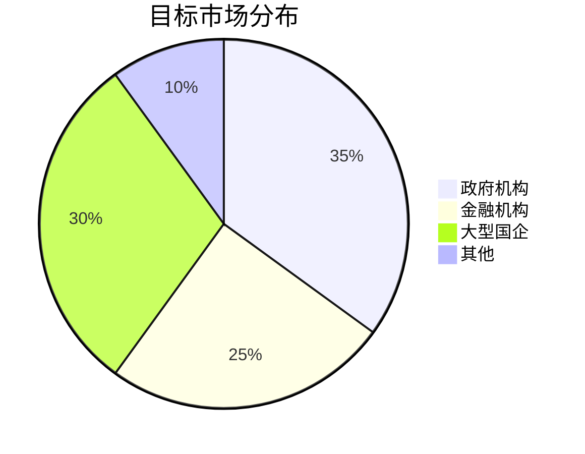

# 商业化方案

## 1. 产品定位
### 1.1 核心价值主张


### 1.2 技术优势
- 全栈国产化适配
- 自主可控加密体系
- 双活数据中心支持

## 2. 商业模式
### 2.1 收费模式
| 模式        | 计费单位 | 价格区间   | 适用场景       |
|------------|---------|-----------|---------------|
| 授权许可    | CPU核/年 | 5-8万     | 大型私有化部署 |
| SaaS订阅    | 用户/月  | 300-800   | 中小型企业     |
| 定制开发    | 人天     | 1.5-2万   | 特殊需求场景   |

### 2.2 成本结构
```yaml
# 成本占比示例
development: 40%  # 研发成本
operation: 30%    # 运维成本
security: 20%     # 安全合规
others: 10%       # 其他支出
```

## 3. 实施路线
### 3.1 阶段规划
1. 试点验证期 (0-6个月)
   - 完成3家标杆客户
   - 通过等保三级认证
2. 规模推广期 (7-18个月)
   - 建立区域服务中心
   - 发展渠道合作伙伴
3. 生态建设期 (19-36个月)
   - 形成开发者社区
   - 建立认证培训体系