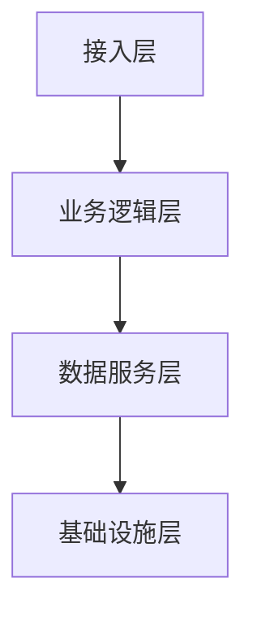

# 技术架构文档

## 1. 核心架构设计
### 1.1 系统分层


### 1.2 国产技术栈
- 操作系统：统信UOS/麒麟
- 数据库：达梦DM8/TiDB
- 中间件：东方通TongWeb
- 安全组件：江南科友加密机

## 2. 高可用方案
### 2.1 双活数据中心
```yaml
# 部署配置示例
deployment:
  mode: dual-active 
  sites:
    - location: 上海
      weight: 60%
    - location: 深圳  
      weight: 40%
```

### 2.2 故障转移
- 秒级服务检测
- 自动流量切换
- 数据一致性保障

## 3. 性能指标
| 场景          | QPS   | 响应时间 | 容错率 |
|--------------|-------|--------|-------|
| 普通查询      | 5000  | <200ms | 99.95%|
| 复杂分析      | 800   | <1s    | 99.9% |